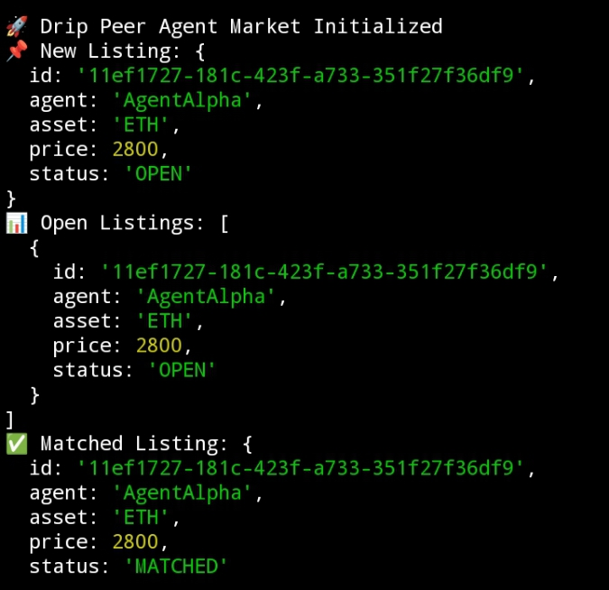

# 🚀 Drip Peer

> A decentralized P2P Agent Market built on top of Intercom infrastructure.

Forked from: Trac-Systems/intercom  
Built by: @dripitmyback

---

## 💰 Trac Address

trac1aupr0e3ez85sk5cp4f6k0548h5uggm0yekv49hp0q60fy4lfazhqsyzw0s

---

## 🧠 Overview

Drip Peer is a modular P2P agent marketplace that extends Intercom's
peer communication layer into a decentralized trading environment.

Agents can create listings, broadcast offers, and match counterparties
within a simulated market engine.

This demonstrates how Intercom can evolve beyond messaging into
functional economic coordination between agents.

---

## 🧩 Features

- 📡 Peer-Compatible Architecture
- 🧠 Agent Listing Engine
- 🔄 Matching Logic
- ⚙️ Modular Market Engine
- 🧱 Extensible Design

---

## ⚙️ Installation

Clone:
     • git clone https://github.com/dripitmyback/drippeer.git
     • cd drippeer/drip-peer-market

Install dependencies:
     • npm install

Run:
     • node index.js

## 📸 Proof of Execution

Below is proof that Drip Peer Agent Market runs successfully:

The screenshot demonstrates:

- 🚀 Drip Peer Agent Market Initialized
- 📌 Listing creation working
- 📊 Open listings displayed
- ✅ Matching logic executed successfully
